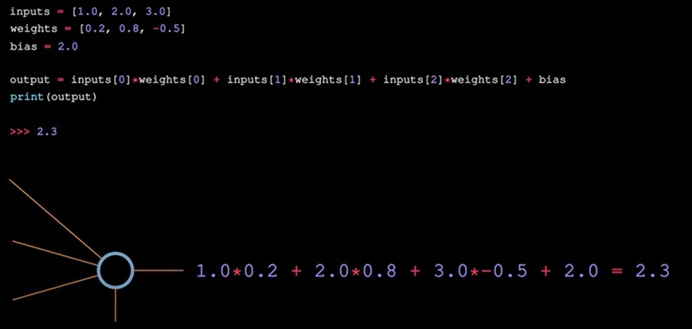
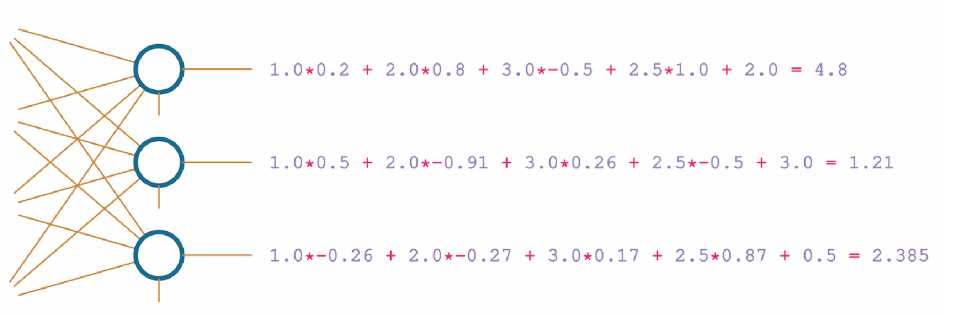

# Artificial Neural Network Tutorial

Area:

Artificial Intelligence -- Machine Learning -- Neural Network -- Deep Neural Network

__CHAPTER 01:__  
A brief History: 

```
Neural Networks were concived in the 1940s, but figuring out how to train them remained a mystery for 20 years. The concept of backpropagation came in the 1960s, but finally revealed in 2010. NN has the ability to operate self-driven cars, calculating risk, detecting fraud, early cancer detection. 
``` 

WHat is neural networks:

```
neural networks are considered to be black box.

Y = mX + c or output = weight x input + bias
As a very general overview, the step function meant to mimic a neuron in the brain, either “firing” or not — like an on-off switch.
The output layer often has as many neurons as the training dataset has classes. 
When the algorithm only learns to fit the training data but does not actually understand anything about underlying input-output dependencies, the network basically just "memorizes"
the training data is known as overfitting. Learning to fit the data instead of memorizing inside the neural network is called generalization. 
Model "Train" Mainly refers slowly adjusting weights and biases of a neural network. Loss calculation is also an important term in NN. 
Alongside Classification, NN can perform the following tasks:
1. Regression (predict a scalar, singular value)
2. Clustering (assign unstructured data into groups)
3. Generation (Creating new data)
4. Sequence Modeling (language translation, speech recognision, music generation)
5. Reinforcement Learning
6. Anomaly Detection
7. Data Compression / Feature Extration (convert data to smaller size, infromation extraction from image or text)
```

__CHAPTER 02:__  

__A Single Neuron:__  

```python
    inputs = [1,2,3]

    """ 
    For each input also needs a weight associated with it. weight is a tunable value, 
    For n inputs there are n weights, but bias is only one
    """
    weights = [0.2, 0.8, -0.5]
    bias = 2

    output = (inputs[0]*weights[0] + inputs[1]*weights[1] + inputs[2]*weights[2]) + bias
    print(output)
```



__A layer of Neurons:__  

__An instance of Fully Connected Neural Network__  



```
Layers are nothing more than groups of neurons.
```
```python
    inputs = [1,2,3,2.5]
    weight1 = [0.2,0.8,-0.5,1]
    weight2 = [0.5,-0.91,0.26,-0.5]
    weight3 = [-0.26,-0.27,0.17,0.87]
    bias1 = 2
    bias2 = 3
    bias3 = 0.5

    outputs = [
            inputs[0]*weight1[0]+ inputs[1]*weight1[1] + inputs[2]* weight1[2] + inputs[3]*weight1[3]+ bias1, 
            inputs[0]*weight2[0]+ inputs[1]*weight2[1] + inputs[2]* weight2[2] + inputs[3]*weight2[3]+ bias2, 
            inputs[0]*weight3[0]+ inputs[1]*weight3[1] + inputs[2]* weight3[2] + inputs[3]*weight3[3]+ bias3, 
    ]

    print(outputs)

```
