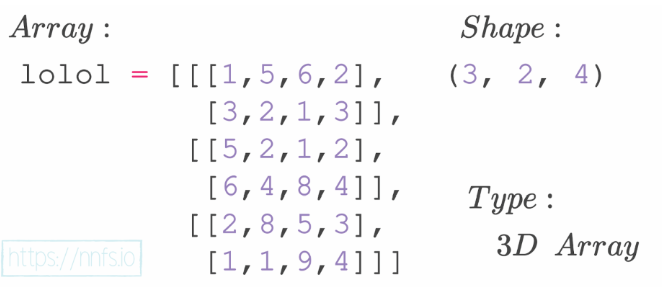
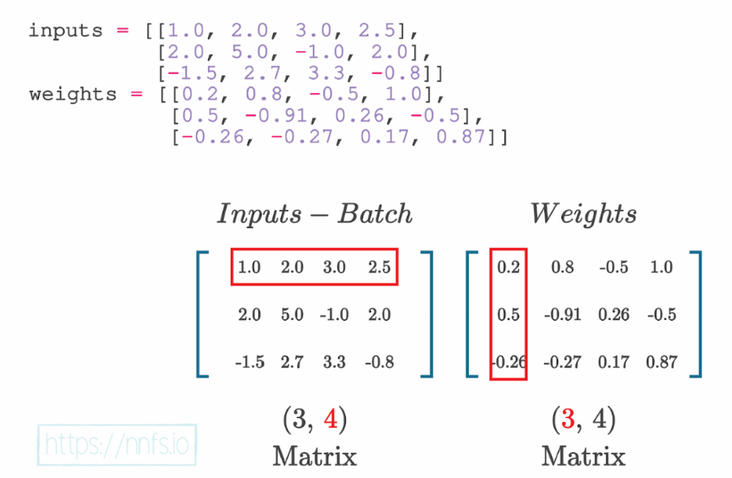

# Artificial Neural Network Tutorial

Area:

Artificial Intelligence -- Machine Learning -- Neural Network -- Deep Neural Network

__CHAPTER 01:__  
A brief History: 

```
Neural Networks were concived in the 1940s, but figuring out how to train them remained a mystery for 20 years. The concept of backpropagation came in the 1960s, but finally revealed in 2010. NN has the ability to operate self-driven cars, calculating risk, detecting fraud, early cancer detection. 
``` 

WHat is neural networks:

```
neural networks are considered to be black box.

Y = mX + c or output = weight x input + bias
As a very general overview, the step function meant to mimic a neuron in the brain, either “firing” or not — like an on-off switch.
The output layer often has as many neurons as the training dataset has classes. 
When the algorithm only learns to fit the training data but does not actually understand anything about underlying input-output dependencies, the network basically just "memorizes"
the training data is known as overfitting. Learning to fit the data instead of memorizing inside the neural network is called generalization. 
Model "Train" Mainly refers slowly adjusting weights and biases of a neural network. Loss calculation is also an important term in NN. 
Alongside Classification, NN can perform the following tasks:
1. Regression (predict a scalar, singular value)
2. Clustering (assign unstructured data into groups)
3. Generation (Creating new data)
4. Sequence Modeling (language translation, speech recognision, music generation)
5. Reinforcement Learning
6. Anomaly Detection
7. Data Compression / Feature Extration (convert data to smaller size, infromation extraction from image or text)
```

__CHAPTER 02:__  

__A Single Neuron:__  

```python
    inputs = [1,2,3]

    """ 
    For each input also needs a weight associated with it. weight is a tunable value, 
    For n inputs there are n weights, but bias is only one
    """
    weights = [0.2, 0.8, -0.5]
    bias = 2

    output = (inputs[0]*weights[0] + inputs[1]*weights[1] + inputs[2]*weights[2]) + bias
    print(output)
```


__A layer of Neurons:__  

__An instance of Fully Connected Neural Network__  


```python
    """
        Layers are nothing more than groups of neurons.
    """
    inputs = [1,2,3,2.5]
    weight1 = [0.2,0.8,-0.5,1]
    weight2 = [0.5,-0.91,0.26,-0.5]
    weight3 = [-0.26,-0.27,0.17,0.87]
    bias1 = 2
    bias2 = 3
    bias3 = 0.5

    outputs = [
            inputs[0]*weight1[0]+ inputs[1]*weight1[1] + inputs[2]* weight1[2] + inputs[3]*weight1[3]+ bias1, 
            inputs[0]*weight2[0]+ inputs[1]*weight2[1] + inputs[2]* weight2[2] + inputs[3]*weight2[3]+ bias2, 
            inputs[0]*weight3[0]+ inputs[1]*weight3[1] + inputs[2]* weight3[2] + inputs[3]*weight3[3]+ bias3, 
    ]

    print(outputs)

```
What is Tensor ? 

```
A tensor is a mathematical object that object that generalizes scalers, vectors, and matrices to higher dimentions. 
A scalar is just a single number → 0D tensor.
A vector is an array of numbers (like [1,2,3]) → 1D tensor.
A matrix is a 2D grid of numbers (like a table) → 2D tensor.
A tensor can be 3D, 4D, or higher → used to store complex data (e.g., images, videos).
A tensor is an object that can be represented as an array.
```

```python

import numpy as np
#Scalar (0D tensor)
scalar = np.array(5)   # shape ()
#Vector (1D tensor)
vector = np.array([1, 2, 3])   # shape (3,)
#Matrix (2D tensor)
matrix = np.array([[1, 2, 3],
                   [4, 5, 6]])   # shape (2, 3)
#3D Tensor (stack of matrices)
tensor_3d = np.array([[[1, 2], [3, 4]],
                      [[5, 6], [7, 8]]])   # shape (2, 2, 2)

"""
Explanation of shape (2, 2, 2)
First 2 → There are 2 blocks (like 2 matrices stacked).
Second 2 → Each block has 2 rows.
Third 2 → Each row has 2 columns.
https://nnfs.io/lqw/
"""


```



__Dot Product and Vector Addition:__  
A cross product results in a vector while a dot product results in a scalar

Lets take input as batch size:
```python
inputs = [
    [1.0,2.0,3.0,2.5],
    [2.0,5.0,-1.0,2.0],
    [-0.15,2.7,3.3,-0.8]
]
```



What is the benefit of Transpose of Weight Matrix ? 

Y = X.W^T + C

__The number of neurons for the next layer from input layer, depends on the weight matrix__ if input layer has 3 input and weight matrix has 4x4 
then the next layer neurons will be row number of weight. 

__CHAPTER 3:__  

__Adding Layers__  
```
Neural network become "deep" when they have 2 or more hidden layers. Why it is important to add two or more hidden layers ?
inputs [ 1,2,3,4] in this Tensor there are four features. weights are often initialized randomly for a model, but not always. If you 
wish to load a pre-trained model, you will initialize the parameters to whatever that pretrained 
model finished with. It’s also possible that, even for a new model, you have some other 
initialization rules besides random. 
```
```python

class Layer_Dense:
    def __init__(self, n_inputs,n_neurons):
        pass
    def forward(self,inputs):
        pass


```

__Forward pass:__  
When we pass data through a model from beginning to end, this is called a forward pass. 

__Activation Function:__  
1. Linear Activation Fuction ; y = mx+c
2. The Sigmoid Activation Function; y = 1/(1+e^-x)
3. Rectified Linear Unit Activation Function